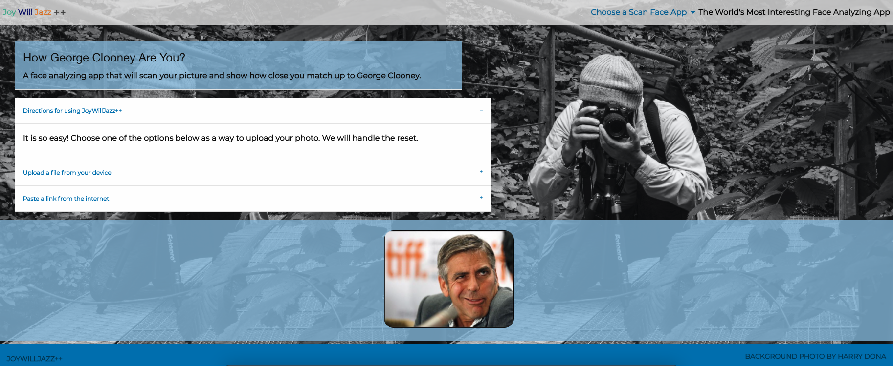
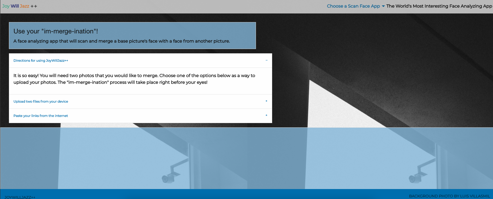

# JoyWillJazz++ --- Project 1 

## Description 
We have created 3  applications. The first is called "Scan your Face-alizer", this application sends the users photo to an API called Face ++ which analyzes the problem areas of their skin and face. We then send that information to a second Google Search API which searches predetermined sites for products that could help with those problem areas. The second and third were stretch goals realized. The second compares the users face to an image of George Clooney and gives them a percentage of similarity to George Clooney's face. The third allows the user to merge their face with someone elses to create a new face. The applications that we have created serve several purposes. The utilitarian purpose of our first application is second to  the penultimate purpose of all of these applications to amuse and entertain the user. The idea that their photo can be analyzed for problem areas and then they can be recommended a product for the process is enough to wow most users with the advancements we have made over the years in technology. The final stretch goal for this product would be for it to give the most accurate recommendation to the user. However, that is dependant on the reliability or "confidence" of the Face ++ API. 

## Table of Contents 

* [Installation](#installation)
* [Usage](#usage)
* [Credits](#credits)
* [License](#license)

## Installation
The application is hosted on GitHub Pages environment [JoyWillJazz++](https://refuge001.github.io/JoyWillJazzPlusPlus/)
The link to the repository is [JoyWillJazz++-Repo](https://github.com/Refuge001/JoyWillJazzPlusPlus)

## Usage 

The user has the option of uploading a photo or pasting a link to to their photo. The photo is then provided via AJAX call to the Face ++ API. When the results are returned, the ((Selected Websites - Target)) are searched for products that they sell to assist with those problem areas. 
 

## Credits

We took a collaborative approach including utilizing Live-Share, Zoom, and Slack to code together. We worked in unity and in groups utilizing our personal strengths in particular areas but also working to bounce idea off of one another. We assigned task initially but all worked more cohesively than anticipated. We believe we will all leave this stronger in all aspects that were touched upon in this project. 

Jasmine - https://github.com/jasdjames 
Will - https://github.com/Refuge001
Joy - https://github.com/JoyUmoekpo

[Background] (https://unsplash.com/photos/TMQWIN5ITlg?utm_source=unsplash&utm_medium=referral&utm_content=creditShareLink)

We utilized Foundation and attached documentation for most of our HTML and CSS layout 
(https://get.foundation/building-blocks/blocks/mobile-bottom-bar.html)

[Opacity] (https://www.w3schools.com/cssref/func_rgba.asp)

[Backgroud]https://developer.mozilla.org/en-US/docs/Web/CSS/background-size

[Deciding on CSS] (https://geekflare.com/best-css-frameworks/)
[Alt""](https://www.w3schools.com/tags/att_img_alt.asp#:~:text=The%20required%20alt%20attribute%20specifies,user%20uses%20a%20screen%20reader).)

[Organizing CSS](https://developer.mozilla.org/en-US/docs/Learn/CSS/Building_blocks/Organizing)
## License
MIT License

Copyright (c) [2020] [Jas-Will-Joy]

Permission is hereby granted, free of charge, to any person obtaining a copy of this software and associated documentation files (the "Software"), to deal in the Software without restriction, including without limitation the rights to use, copy, modify, merge, publish, distribute, sublicense, and/or sell copies of the Software, and to permit persons to whom the Software is furnished to do so, subject to the following conditions:

The above copyright notice and this permission notice shall be included in all copies or substantial portions of the Software.

THE SOFTWARE IS PROVIDED "AS IS", WITHOUT WARRANTY OF ANY KIND, EXPRESS OR IMPLIED, INCLUDING BUT NOT LIMITED TO THE WARRANTIES OF MERCHANTABILITY, FITNESS FOR A PARTICULAR PURPOSE AND NONINFRINGEMENT. IN NO EVENT SHALL THE AUTHORS OR COPYRIGHT HOLDERS BE LIABLE FOR ANY CLAIM, DAMAGES OR OTHER LIABILITY, WHETHER IN AN ACTION OF CONTRACT, TORT OR OTHERWISE, ARISING FROM, OUT OF OR IN CONNECTION WITH THE SOFTWARE OR THE USE OR OTHER DEALINGS IN THE SOFTWARE.